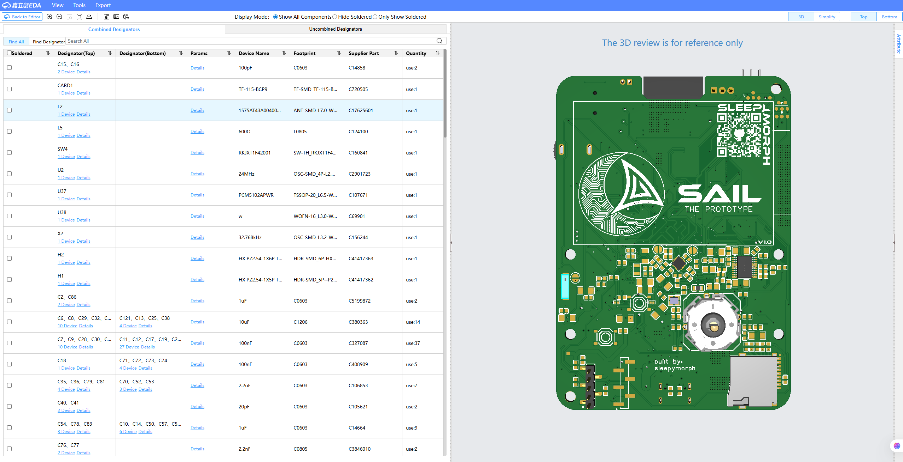
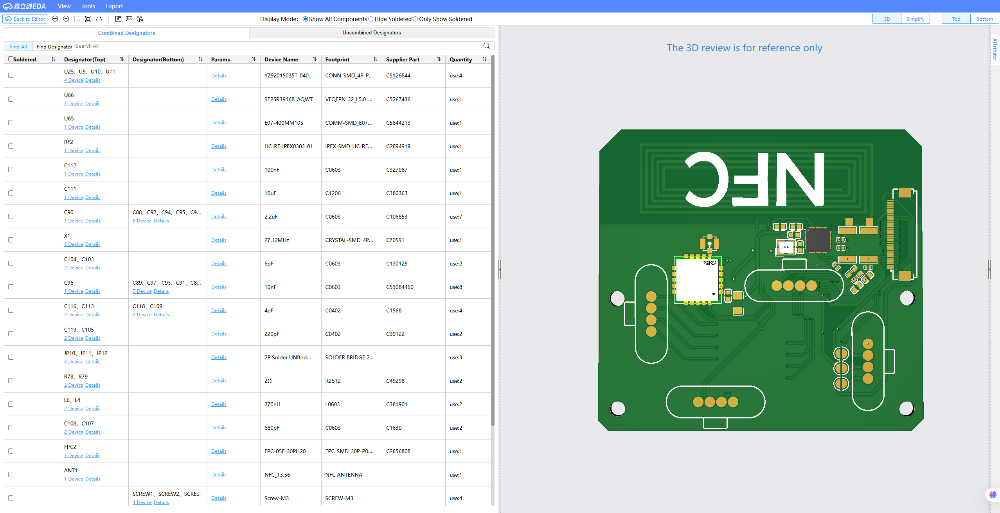
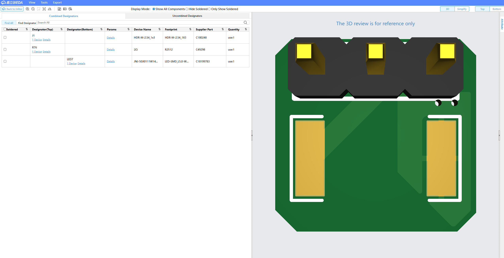

<picture>
  <source media="(prefers-color-scheme: dark)" srcset="LOGO/black.png">
  <source media="(prefers-color-scheme: light)" srcset="LOGO/white.png">
  
</picture>
 

<h1 align="center"><b>SAIL THE PROTOTYPE</b></h1>

---

**SAIL The Prototype** is a [DMP](https://en.wikipedia.org/wiki/Digital_media_player), an open-source project that plans to be a startup. This is not a basic digital media player, but also a multi-tool. It has 433MHZ CC1101, [Infrared LED](https://www.lcsc.com/product-detail/C18199783.html), and NFC functions(13.56MHZ). 
The STM32H723 is a powerful MCU for that project, I would say even an overkill. 

Hardware Architecture:
  1. Main Board: Houses the STM32, ESP32, Display, and user input interfaces
  2. NFC Board: Contains the NFC circuitry, CC1101(currently 433 MHZ only), and magnetic pogo pin connectors
  3. Infrared Board: Dedicated to IR Transceiver

The goal of the project is to combine multi-tool device with a music player, making you less addicted and helps you to escape social media & algorithms(bad ones).

|*MAIN Board* Top Component Layer                                                                                                    |*MAIN Board* Bottom Component Layer                                                                                                              |  
|  :---                                                                                                                              |   :---                                                                                                                              |
| |  |

---

    <b>Click the picture to see MAIN Board IBOM!</b>
  </a>

---

So, lets get into the details. First of all, lets talk about see here the most, to be exact - the user input devices.

The most valuable thing you can see here is probably the big [encoder](https://www.lcsc.com/product-detail/C160841.html). The encoder is pretty cool, its being used widely, especially at the automotive solutions. 

Its a 5-way button + encoder functions, to be exact its going 5 directions(X+, Y+, X-, Y-), pressing down, scrolling phase A and B. Next thing are 2 buttons, I still have no clue what I will use them for, but probably next song - previous song.

The most hidden, but probably the coolest thing of the device is the [thumb potentiometer](https://www.lcsc.com/product-detail/C351175.html), its placed at the left edge of the board, next to the left end to the display. 

---
<h1 align="center"><b>NFC Board</b></h1>

    <b>Click the picture to see the NFC PCB IBOM!</b>
  </a>

--- 

NFC Board that contains half out of all of the functionality of the device --

It has NFC, CC1101 *433 MHz only yet*, and as a juicy cherry on a chocolate dry cake -
magnetic pogo pins for a breakout board. Here is the pinout if you would like to make a breakout board (in development)

---
<h1 align="center"><b>Infrared board</b></h1>

    <b>Click the picture to see the Infrared PCB IBOM!</b>
  </a>

---

I couldnt find any good IR Transceiver which was right angled, so instead I found a really good SMD 5050 LED, its powerful enough to remote something on the distance ~15M by my calculations

---
# 3D Design:

Here is an image how it looks from the side, I explained a big rectengular right there and a strange looking knob right there too

---

# Fusion360 Render:

The 3D files are in the Release folder since GitHub didnt want to accept files <25MB, there are 2 files, a Knob and fully assembled PCB(No casing yet)

---

<h1 align="center"><b>More details and summary</b></h1>

| **Feature**                    | **Details**                                                                                                                                          |
|-------------------------------|------------------------------------------------------------------------------------------------------------------------------------------------------|
| **Main MCU**                       | STM32H723 as a main MCU that does all the work                                   |
| **Secondary MCU**                  | ESP32-WROVER-IE(16MB) for BlueTooth headphones and pogo pin connectors(IOs)                                                                                             |
| **2.4" IPS TFT Display**           | 2.4" IPS Display connected via FPC, 8080 16-bit protocol. [BuyDisplay](https://www.buydisplay.com/2-4-inch-ips-240x320-tft-lcd-display-capacitive-touch-screen)                               |
| **Multi-Tool features**            | [NFC Module](https://www.lcsc.com/product-detail/C5267436.html), CC1101 *433 MHz ONLY*, IR Transceiver, Receiver                |
| **RTC**                    | BS-CR2032-8 battery slot for [RTC functionality](https://www.lcsc.com/product-detail/C9866.html), and MAX-M10S-00B(GPS component) for RTC Syncing                       |
|	~~**Metal Body**~~                 | ~~Aluminium front and back plate; 3D-printed middle section~~ *plan for future*                                                                                              |
| **Power and file transmitting**    | USB-C Port which allows high speed data transfer(up to 50MB/s) with help of [USB3300](https://www.lcsc.com/product-detail/C108954.html) , and of course power delievery                                             |
| **Battery Type**             | 2500mAh Li-Ion battery, 103450, [Aliexpress](https://www.aliexpress.com/item/1005008825499071.html?spm=a2g0o.detail.pcDetailTopMoreOtherSeller.1.51ffSwlrSwlrjB&gps-id=pcDetailTopMoreOtherSeller&scm=1007.40050.354490.0&scm_id=1007.40050.354490.0&scm-url=1007.40050.354490.0&pvid=2d759c26-5379-4d10-b826-4eb722d78d08&_t=gps-id%3ApcDetailTopMoreOtherSeller%2Cscm-url%3A1007.40050.354490.0%2Cpvid%3A2d759c26-5379-4d10-b826-4eb722d78d08%2Ctpp_buckets%3A668%232846%238108%231977&pdp_ext_f=%7B%22order%22%3A%22495%22%2C%22eval%22%3A%221%22%2C%22sceneId%22%3A%2230050%22%2C%22fromPage%22%3A%22recommend%22%7D&pdp_npi=6%40dis%21USD%2110.49%216.29%21%21%2171.38%2142.83%21%40211b65de17772217116784494e6405%2112000046836099274%21rec%21UA%216416141679%21XZ%211%210%21n_tag%3A-29919%3Bd%3Abd2102de%3Bm03_new_user%3A-29895&utparam-url=scene%3ApcDetailTopMoreOtherSeller%7Cquery_from%3A%7Cx_object_id%3A1005008825499071%7C_p_origin_prod%3A)                                         |
| **Battery Life**             | ~8 hours idle, 4-5 hours typical usage                                                                                                                 |
| **Battery Voltage Measurement** | ADC Technology, connected to pin PA0 of STM32H7        |
| **Magnet on Back Plate of NFC Board(Pogo pins)**     | [4x 4-Pin Pogo pin connector](https://www.lcsc.com/product-detail/C5126844.html) is a female version. For a breakout board you would need this [magnetic connector](https://www.lcsc.com/product-detail/C5126845.html?s_z=n_q_YZP0048-20048-04025-03&spm=wm.ssy.bg.0.xh&lcsc_vid=RwRWBFMFT1dZU1UCRVJcX11STgVXUVICQwBZVwYFRQAxVlNRQFNcVVRTRlhWUzsOAxUeFF5JWBYZEEoKFBINSQcJGk4eFQsCAgIaSgADAwAHC0slQlBcUVxSQ08GEwkK)  |
| **Audio components**               | [PCM5102APWR](https://www.lcsc.com/product-detail/C107671.html) as a DAC, [TPA6132A2RTER](https://www.lcsc.com/product-detail/C69901.html) as an AMP and a [PJ-327A 5JJ](https://www.lcsc.com/product-detail/C668605.html?s_z=n_q_PJ-327A%25205JJ&spm=wm.ssy.bg.0.xh&lcsc_vid=RgReVVxRRFgLUlFfQlJXAVEAFVhaX1EDT1YIBQVVQlYxVlNRQFNcVVZTRlFdUTsOAxUeFF5JWBYZEEoKFBINSQcJGk4eFQsCAgIaSgADAwAHC0slQVhXV1VIHxUDCw%3D%3D) as a jack 3.5mm connector for headphones.           |  

---

## .IOC

---

<h1 align="center"><b>Funded by:</b></h1>

<picture>
  <source media="(prefers-color-scheme: dark)" srcset="LOGO/flag-standalone-wtransparent.png">
  <source media="(prefers-color-scheme: light)" srcset="LOGO/flag-standalone-bw.png">
  
</picture>
 

